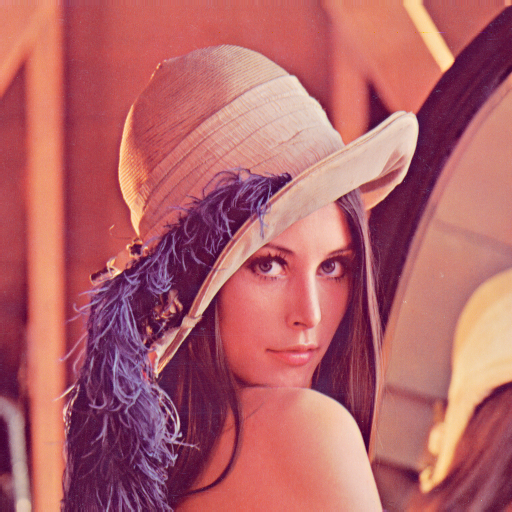

<H1> Image processing methodes in python </h1>
  <H6> Extract patches from image </H6>
  <H6> Reconstruct image from list of patches </H6>
  <H6> Usefull for image preprocessing in deep learning </H6>

<H3> Extract image patches : </H3>
<ul>
 <li> <H4> Original Image </H4> </li> 
  
 <li> <H4> Patches </H4> </li> 
  
</ul>
<H3> Reconstruct image from patches list : </H3>
<ul>
 <li> <H4> Reconstructed image </H4> </li> 
    
</ul>
